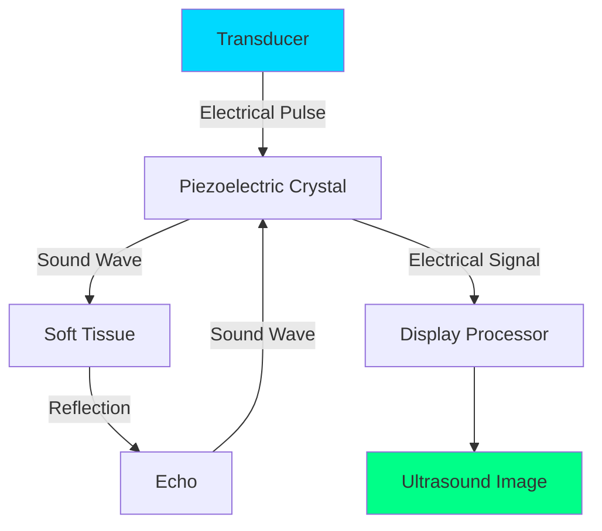
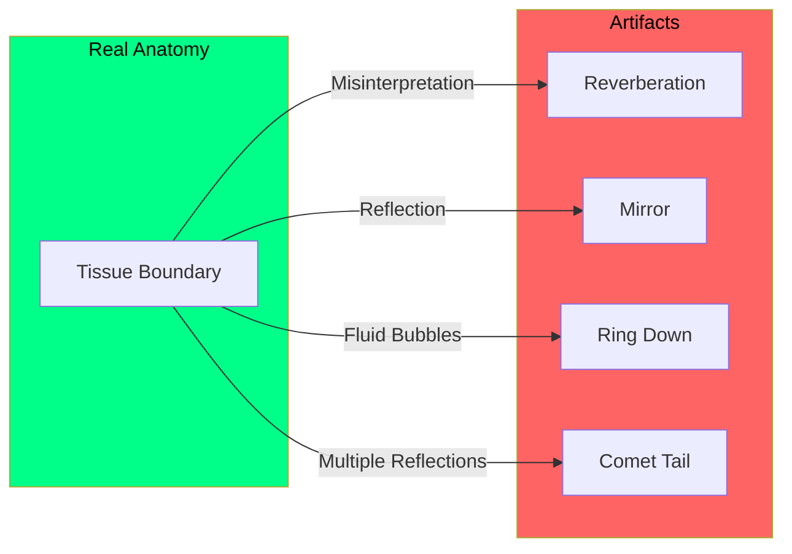
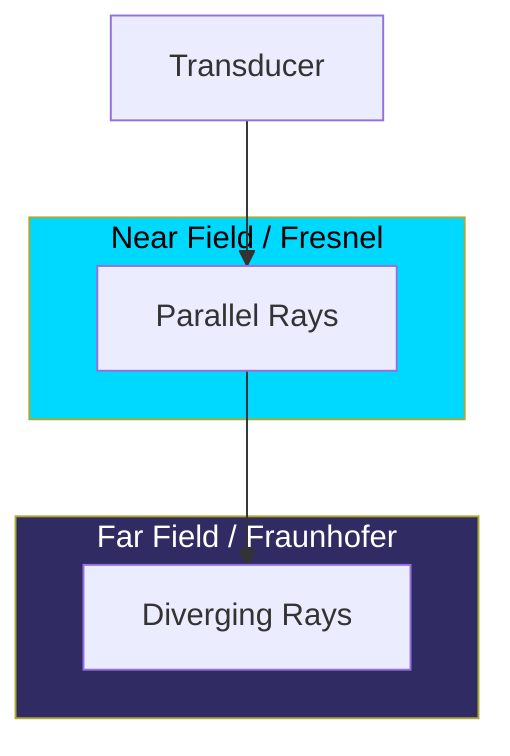
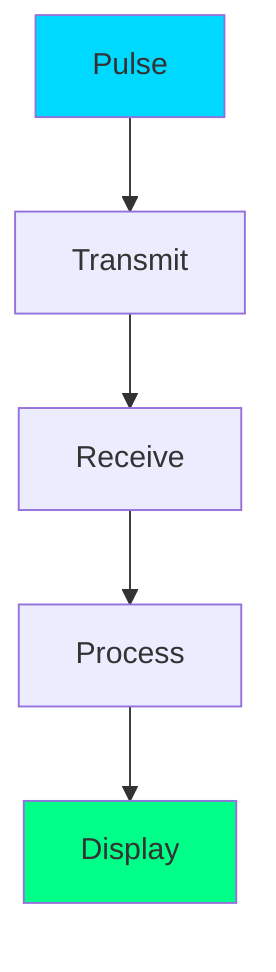
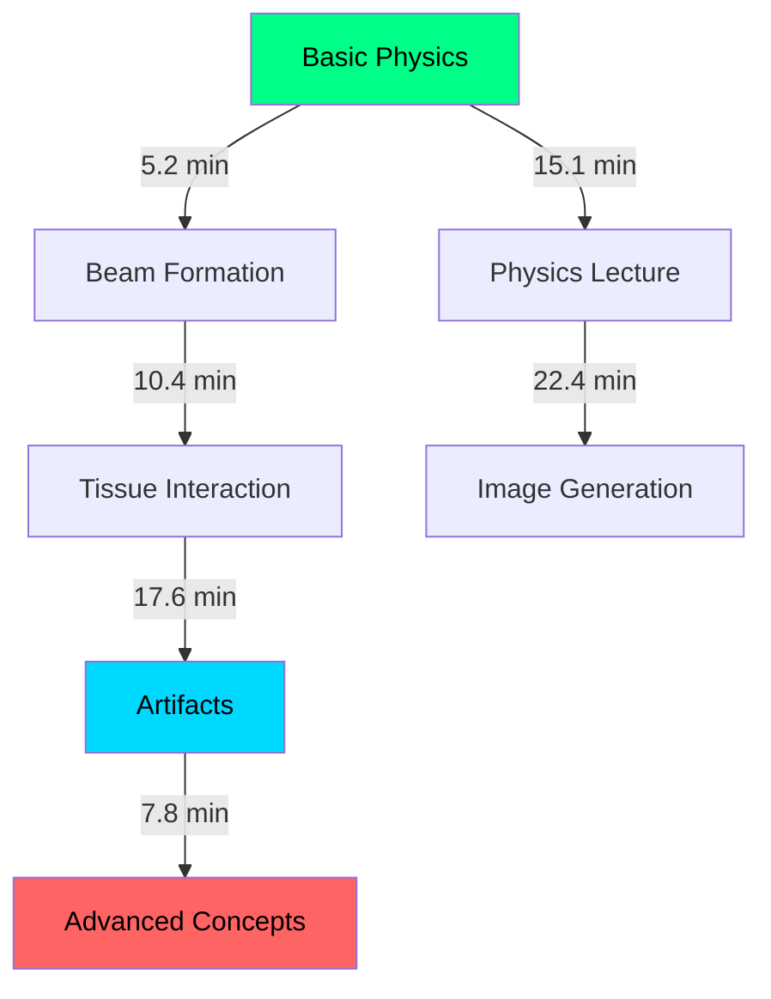
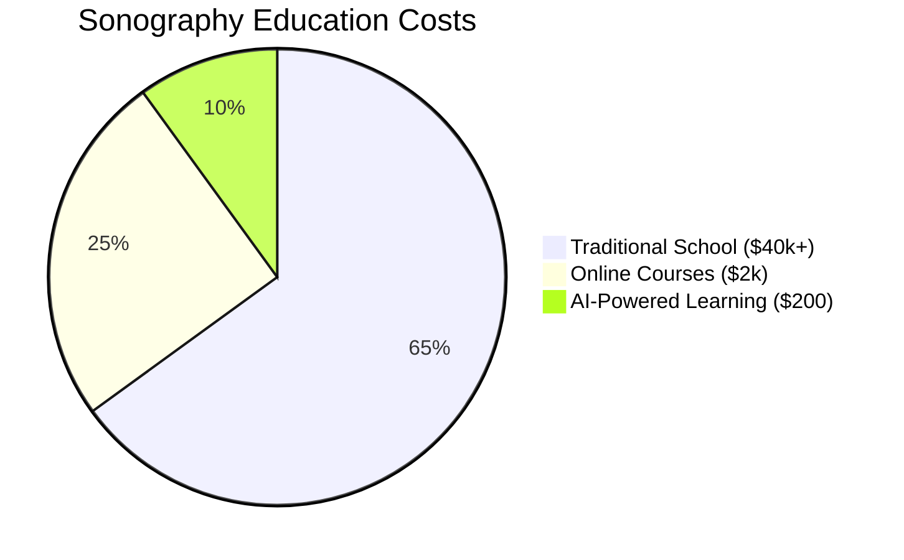
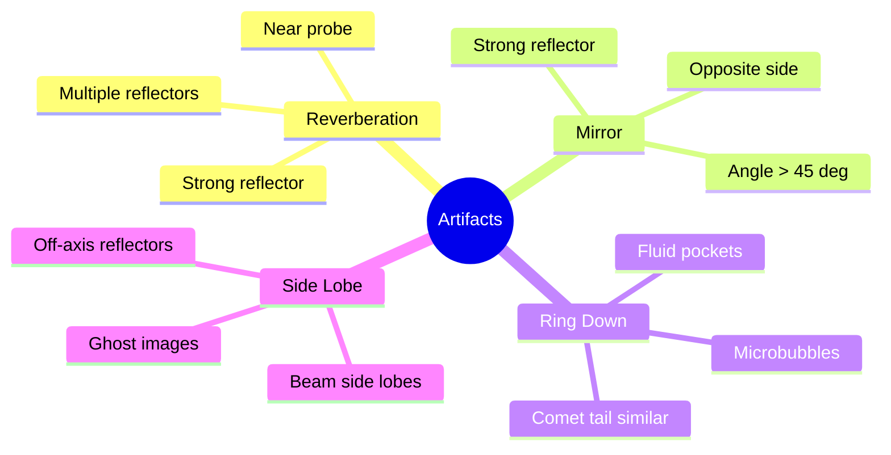
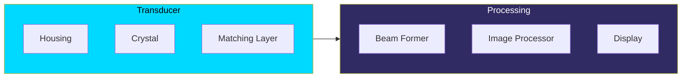

# Ultrasound Physics Diagrams

Collection of Mermaid diagrams for sonography learning.

---

## Ultrasound Wave Propagation

---

## Artifact Types

---

## Ultrasound Beam Types

---

## Image Formation Process

---

## Learning Path: Ultrasound Physics

---

## Cost Comparison

---

## ARDMS Exam Prep

---

## Quick Reference: Artifact Causes

---

## Equipment Setup

